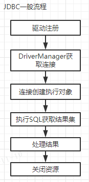
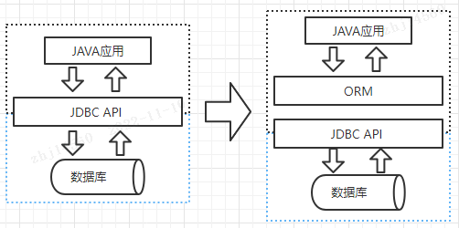

#### 1、JDBC

##### JDBC操作数据库

JDBC是用于Java编程语言和数据库之间的数据库无关连接的标准Java API。换句话说，使用JAVA语言连接数据库进行操作，就需要使用JDBC API。统一的JDBC API接口，屏蔽了底层数据库的细节，可以使用一致性的编码（跨数据库）对数据库进行操作。

JDBC操作数据库大致三个步骤:

1. 连接数据库

2. 执行SQL

3. 处理返回结果

   

   JDBC示例

```
ConnectionImpl conn = null;
PreparedStatement stmt = null;
ResultSetImpl rs = null;
try {
    // 注册驱动程序
    Class.forName("com.mysql.jdbc.Driver");
    // 获取链接
    conn = (ConnectionImpl) DriverManager.getConnection("jdbc:mysql://10.1.32.29:3306/gopher_auth", "gopher_auth", "gopher_auth");
    conn.setAutoCommit(false);
    // 获取 Statement
    stmt = conn.prepareStatement("insert into tbl_sys_role (id, role_name, role_code, system_code) values (?, ?, ?, ?)");
    // 设置参数
    stmt.setString(1, UUID.randomUUID().toString().replace("-", ""));
    stmt.setString(2, "管理员");
    stmt.setString(3, "admin");
    stmt.setString(4, "gims");
    // 执行SQL
    stmt.executeUpdate();
    // 提交事务
    conn.commit();
	// 查询
    stmt = conn.prepareStatement("select * from tbl_sys_role where id = ?");
    stmt.setString(1, "41a68e9895b0437b9d35792c85565a96");
    rs = (ResultSetImpl) stmt.executeQuery();
	// 结果集
    while (rs.next()) {
        System.out.println("id: " + rs.getString("id") + ": roleName: " + rs.getString("role_name"));
    }
} catch (Exception e) {
    e.printStackTrace();
} finally {
    // 清理资源、异常处理
    if (rs != null) {
        try { rs.close(); } 
        catch (SQLException e) { e.printStackTrace(); }
    }
    if (stmt != null) {
        try { stmt.close(); } 
        catch (SQLException e) { e.printStackTrace(); }
    }
    if (conn != null) {
        try { conn.close(); } 
        catch (SQLException e) { e.printStackTrace(); }
    }
}
```

##### JDBC存在的问题

**代码冗余**

借助于JDBC编程，有很多模块化的代码在第一个JDBC示例中，所有的步骤都是需要按部就班完成的。而这些步骤很显然，有些是结构化的模式化的，比如连接数据库，关闭连接，异常处理，但是却不得不处理。JDBC功能足够，但是便捷性欠缺，不够灵活。

**对象映射**

Java作为面向对象编程语言，一切皆是对象，但常用的数据库却是关系型数据库，关系模型就像一张二维表格，一个关系型数据库就是由二维表及其之间的联系组成的一个数据组织，这并不是对象型的，JDBC的操作方式是也不是面向对象的。

在对象与关系型数据库的字段之间，缺少用于将字段与对象进行映射对照，只能由程序员借助于JDBC自己手动的将字段组装成对象，JDBC对象的映射全靠自己。

#### 2、ORM框架

ORM：对象关系映射（Object Relational Mapping）

JDBC将应用程序开发者与底层数据库驱动程序进行解耦，作为中间层承上启下，而ORM是插入在应用程序与JDBCAPI之间的一个中间层，JDBC并不能很好地支持面向对象的程序设计，ORM解决了这个问题。

ORM工具就是JDBC的封装，用于完成Java对象与关系型数据库的映射，简化了JDBC的使用。



ORM工具框架最大的核心就是封装了JDBC的交互，不再需要处理结果集中的字段或者行或者列，借助于ORM可以快速进行开发，而无需关注JDBC交互细节。

**常见的ORM框架** ：mybatis（ibatis）Hibernate 等


#### 3、MyBatis

##### 什么是 MyBatis

MyBatis 是一款优秀的持久层框架，它支持自定义 SQL、存储过程以及高级映射。MyBatis 免除了几乎所有的 JDBC 代码以及设置参数和获取结果集的工作。MyBatis 可以通过简单的 XML 或注解来配置和映射原始类型、接口和 Java POJO（Plain Old Java Objects，普通老式 Java 对象）为数据库中的记录。
[参考文档]: https://mybatis.net.cn/	"MyBatis中文网"

##### MyBatis操作数据库

```
// 加载 mybatis 全局配置文件
InputStream inputStream = Resources.getResourceAsStream("mybatis-config.xml");
// 创建 SqlSessionFactory 对象
SqlSessionFactory sqlSessionFactory = new SqlSessionFactoryBuilder().build(inputStream);
// 根据 sqlSessionFactory 获取 session
SqlSession sqlSession = sqlSessionFactory.openSession();
// 获取 mapper 对象，此处返回的是 MapperProxy 动态代理对象
RoleMapper roleMapper = sqlSession.getMapper(RoleMapper.class);
// 执行SQL
TblSysRole role = roleMapper.getRole("111");
System.out.println(role.toString());
```


